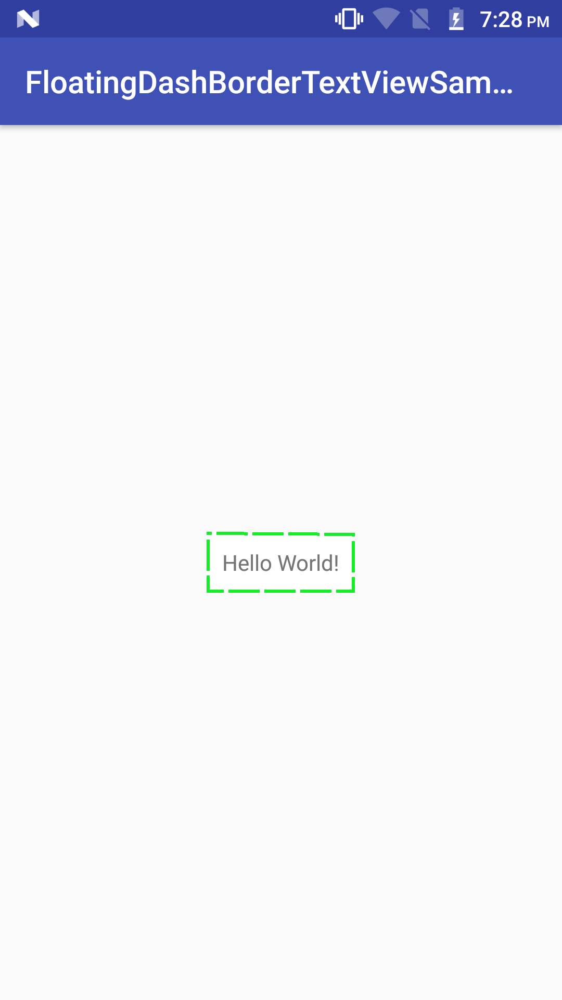

# FloatingDashBorderTextView

This is a custom TextView with floating dash border, all other default TextView features are available. The user can customize the dash color, dash width, dash length, the distance between dashes, floating direction(Clock, Anti-Clock wise), is floating required.
      
## Usage

### Step 1. Add the JitPack repository to your build file
Add it in your root build.gradle at the end of repositories:
```xml
allprojects {
		repositories {
			...
			maven { url 'https://jitpack.io' }
		}
	}
```
### Step 2. Add the dependency
```xml
dependencies {
	implementation 'com.github.JustinGeorgeJoseph:FloatingDashBorderTextView:0.1.0'
	}
```
```xml
<com.justin.floatingdashbordertextview.FloatingDashBorderTextView
        android:layout_width="wrap_content"
        android:layout_height="wrap_content"
        android:text="Hello World!"
        app:dashWidth="2dp"
        app:dashLength="20dp"
        app:dashDistance="3dp"
        app:floatDash="true"
        app:floatClockWise="true"
        app:dashColor="@color/green"
        android:padding="10dp"
        android:background="@color/white"/>
```


